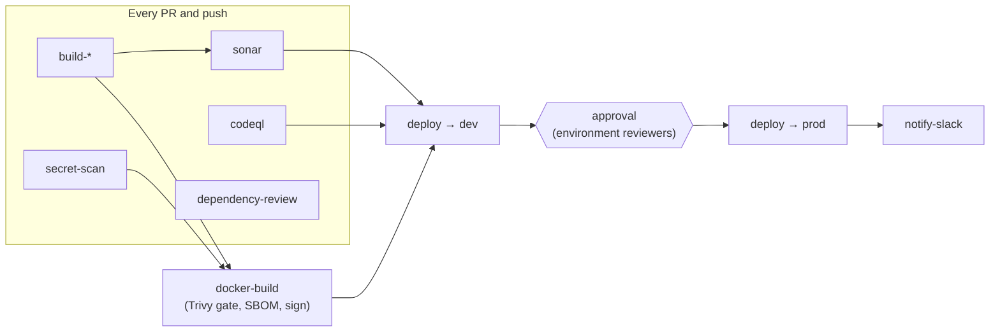

# CI/CD Pipeline Templates

Reusable GitHub Actions workflows for building, scanning, packaging and deploying applications and
infrastructure. Each application repository keeps a short pipeline file that calls these templates, so
build, security and deploy logic is written, reviewed and patched **in one place**.

```yaml
# <your-app-repo>/.github/workflows/pipeline.yml
jobs:
  build:
    permissions:
      contents: read
    uses: utrains/ci-cd-pipeline-templates/.github/workflows/build-node.yml@v2
```

> **New here?** Read [Getting started](docs/getting-started.md) first. It covers the one-time
> setup: repository access, AWS OIDC, environments and secrets.

---

## Catalog

Every template has its own page with a usage example and a generated reference of its inputs, secrets,
outputs and the permissions a caller must grant.

### Build & test

| Template | What it does |
|---|---|
| [`build-node.yml`](docs/workflows/build-node.md) | npm / yarn / pnpm: install, lint, test, build; uploads coverage and build output |
| [`build-java.yml`](docs/workflows/build-java.md) | Maven or Gradle (wrapper-aware), private repos, test and JaCoCo reports |
| [`build-dotnet.yml`](docs/workflows/build-dotnet.md) | restore, build, test with coverage, optional `dotnet publish` |
| [`build-go.yml`](docs/workflows/build-go.md) | vet, golangci-lint, race tests with coverage, build |
| [`build-python.yml`](docs/workflows/build-python.md) | pip / poetry / uv: install, lint, pytest, optional wheel |

### Security & quality

| Template | What it does |
|---|---|
| [`sonar.yml`](docs/workflows/sonar.md) | SonarQube / SonarCloud analysis with a blocking quality gate |
| [`codeql.yml`](docs/workflows/codeql.md) | GitHub CodeQL SAST for one or more languages |
| [`dependency-review.yml`](docs/workflows/dependency-review.md) | Blocks PRs that add vulnerable or disallowed-license dependencies |
| [`secret-scan.yml`](docs/workflows/secret-scan.md) | gitleaks secret detection (PR diff, push range or full history) |
| [`trivy-scan.yml`](docs/workflows/trivy-scan.md) | Trivy scan of an image, the filesystem (dependencies) or IaC config |
| [`iac-scan.yml`](docs/workflows/iac-scan.md) | Checkov policy-as-code for Terraform, Kubernetes, Helm, Dockerfile |
| [`pr-title-lint.yml`](docs/workflows/pr-title-lint.md) | Enforces Conventional Commit PR titles |

### Package & deploy

| Template | What it does |
|---|---|
| [`docker-build.yml`](docs/workflows/docker-build.md) | BuildKit build → Trivy gate → push to ECR / GHCR / Docker Hub, with SBOM, provenance and cosign signing |
| [`ecs-deploy.yml`](docs/workflows/ecs-deploy.md) | New task-definition revision with the new image; waits for the service to become stable |
| [`deploy-eks-helm.yml`](docs/workflows/deploy-eks-helm.md) | `helm upgrade --install --atomic` into EKS |
| [`deploy-eks-argocd.yml`](docs/workflows/deploy-eks-argocd.md) | Argo CD sync, then waits until Synced and Healthy |
| [`gitops-update.yml`](docs/workflows/gitops-update.md) | Bumps the image tag in a GitOps config repo, by PR or direct commit |
| [`terraform.yml`](docs/workflows/terraform.md) | fmt, validate, tflint, plan (as a PR comment), then applies the saved plan behind an approval |

### Flow control & ops

| Template | What it does |
|---|---|
| [`approval.yml`](docs/workflows/approval.md) | Manual approval gate backed by a GitHub Environment |
| [`notify-slack.yml`](docs/workflows/notify-slack.md) | Colour-coded pipeline status posted to Slack |
| [`release-drafter.yml`](docs/workflows/release-drafter.md) | Draft releases from labelled PRs; changelog PR on publish |

---

## Complete pipelines

Copy one of these into an application repository and change the values marked `# ←`.

| Example | Flow |
|---|---|
| [`node-ecs-pipeline.yml`](examples/node-ecs-pipeline.yml) | Node → CodeQL, Sonar, secrets, dependency review → ECR image → ECS dev → **approval** → ECS prod → Slack |
| [`java-eks-helm-pipeline.yml`](examples/java-eks-helm-pipeline.yml) | Maven → Sonar, Checkov → multi-arch image → EKS staging (Helm) → EKS production on release tags |
| [`python-gitops-argocd-pipeline.yml`](examples/python-gitops-argocd-pipeline.yml) | uv → Trivy fs → signed GHCR image → GitOps commit and Argo CD sync (dev) → GitOps **PR** (prod) |
| [`terraform-pipeline.yml`](examples/terraform-pipeline.yml) | Checkov → plan per environment on PRs → apply dev → **approval** → apply prod |
| [`scheduled-security.yml`](examples/scheduled-security.yml) | Nightly full-history secret scan, dependency and running-image CVE scans, CodeQL |



---

## Conventions all templates follow

| Area | Convention |
|---|---|
| **Supply chain** | Every third-party action is pinned to a full commit SHA with a `# vX.Y.Z` comment. Dependabot updates them weekly after a 7-day cooldown. Downloaded CLIs (gitleaks, Argo CD) are checksum-verified. |
| **Least privilege** | Each job declares only the `permissions` it needs, and every doc lists what the calling job must grant. Callers should set `permissions: {}` at the top level and grant per job. |
| **No script injection** | Inputs reach shell scripts only through `env:`, never as `${{ }}` inside `run:`. |
| **Credentials** | Cloud access uses OIDC (`id-token: write`) only. There are no long-lived AWS keys. `actions/checkout` never persists the token. |
| **Deploy safety** | Deploys run in GitHub Environments (approvals, scoped secrets, history), deploys to the same target are queued with `concurrency`, and every deploy waits for health and rolls back or fails loudly. |
| **Runners** | Every template accepts `runs_on`: a label (`ubuntu-latest`) or a JSON array for self-hosted runners (`'["self-hosted","linux","prod"]'`). |
| **Timeouts** | Every job has a `timeout-minutes`. Most are configurable with `timeout_minutes`. |
| **Traceability** | Images carry OCI labels, an SBOM and SLSA provenance. Deploys write a step summary and link to a GitHub deployment. |

---

## Versioning

Templates are released with semantic versioning. Callers choose how strictly to pin:

| Reference | Gets | Recommended for |
|---|---|---|
| `@v2` | Every backwards-compatible release of v2 (moving tag) | Most application repos |
| `@v2.1.0` | Exactly that release | Change-controlled or regulated repos |
| `@<commit-sha>` | Exactly that commit, immutable | Highest assurance. Dependabot can bump it |
| `@main` | Unreleased changes | Testing the templates only; **never production** |

Breaking changes (removed or renamed inputs, changed defaults that alter behaviour) only ship in a new major version,
with migration notes in the [CHANGELOG](CHANGELOG.md).

**Releasing (maintainers):**
1. Merge labelled PRs to `main`. The release draft updates itself.
2. Publish the draft, e.g. `v2.1.0`.
3. Move the major tag: `git tag -f v2 v2.1.0 && git push -f origin v2`.

---

## Repository layout

```
.github/
  workflows/           reusable templates (+ self-ci.yml / release-drafter.yml for this repo)
  release-drafter.yml  release-notes config
  dependabot.yml       keeps pinned action SHAs current
  zizmor.yml           security-lint policy
  CODEOWNERS           platform team owns all changes
docs/
  getting-started.md   one-time setup: access, OIDC, environments, secrets
  workflows/*.md       one page per template (reference tables are generated)
examples/              complete caller pipelines to copy
scripts/
  generate_docs.py     regenerates the reference tables in docs/workflows
```

## Contributing

1. Branch and make the change. New third-party actions **must** be SHA-pinned.
2. Update the usage section of `docs/workflows/<name>.md`, then run `python scripts/generate_docs.py`.
3. Open a PR with a Conventional Commit title and one release label (`feature`, `fix`, `breaking-change`, …).
4. `self-ci.yml` runs **actionlint**, **zizmor** and the docs check. All must pass, and CODEOWNERS must approve.
5. Test from a real caller repository by pointing it at your branch: `uses: …/build-node.yml@my-branch`.
